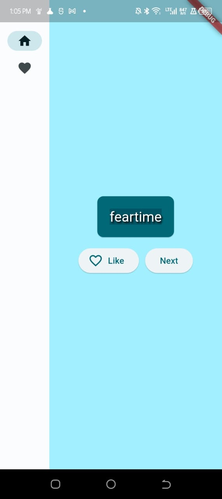

# Random Word Pair Generator

Random Word Pair Generator is a fun and simple Flutter application that generates random word pairs. Developed as a university assignment, this project demonstrates the use of Flutter to create a basic app for generating word combinations.

# Roll Numbers
- **Syed Nofel Talha (20K-0151)**
- **Arhum Hashmi (20K-1892)**
- **Maarib Ul Haq Siddiqui (20K-0202)**

## Features

- **Random Word Pairs:** Generate random word pairs with just a tap.
- **Infinite Combinations:** Explore endless possibilities with the ability to generate new pairs indefinitely.
- **Easy to Use:** Minimalistic design and straightforward interface make it user-friendly for all.
- **University Assignment:** Developed as part of a university assignment to demonstrate practical knowledge of REST API integration in Flutter.

## Update 
- **App has been updated in accordance to classwork 6 (it now stores the liked wordpairs to file)
